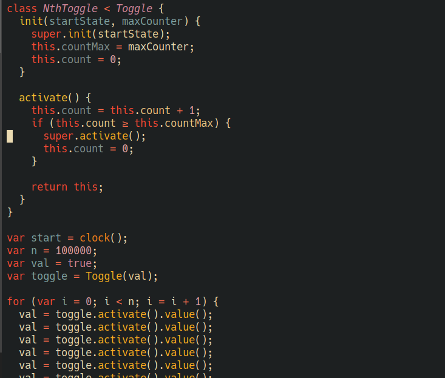

# Lox major mode using tree-sitter

[](https://www.gnu.org/licenses/gpl-3.0)

This is an Emacs major mode for the Lox language developed over the course of
the [Crafting
Interpreters](https://craftinginterpreters.com/the-lox-language.html) book.

It is powered by tree-sitter, using the
[tree-sitter-lox](https://github.com/nverno/tree-sitter-lox) parser, and
provides:

+ Indentation
+ Font-locking
+ Imenu
+ Navigation





## Installing

Emacs 29.1 or above with tree-sitter support is required. 

### Install the tree-sitter-lox parser

```elisp
(add-to-list
 'treesit-language-source-alist
 '(lox "https://github.com/nverno/tree-sitter-lox"))
```

Call `M-x treesit-install-language-grammar` and select `lox` to install.
